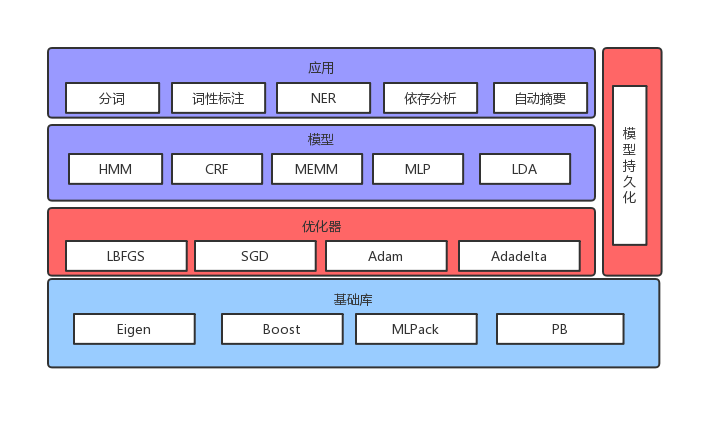

# KNLP [尚未发布]
[](https://www.travis-ci.org/EmbolismSoil/KNLP)
[](https://codecov.io/gh/EmbolismSoil/KNLP)


C++自然语言处理工具库

## 整体架构


## 安装
`KNLP`是一个header-only的`C++`库，只需要包含组件的头文件即可使用

## 例子
`KNLP`所有的组件均可以灵活配置，并且提供了训练、预测、以及持久化接口。以混合分词组件为例，混合分词组件可以组合一个**DAG分词器**和一个**序列标注分词器**，从而用户可以在分词速度和精度之间权衡，下面是一个组合了`Unigram`的DAG分词器和`HMM`序列标注分词器的例子：
```cpp
    using UnigramSegmenter = DAGSegmenter<UnigramLanguageModel>;
    using HMMMixedSegmenter = MixedSegmenter<UnigramSegmenter, HMMSegmenter>;
    std::shared_ptr<UnigramLanguageModel> _unigram_model;
    std::shared_ptr<UnigramSegmenter> _dag_segmenter;
    std::shared_ptr<HMMSegmenter> _hmm_segmenter;
    std::shared_ptr<HMMMixedSegmenter> _mixed_segmenter;

    _unigram_model = std::make_shared<UnigramLanguageModel>();
    _unigram_model->fit("../../dic.txt");//训练语言模型

    _hmm_segmenter = std::make_shared<HMMSegmenter>();
    _hmm_segmenter->fit("../../corpus.txt");//训练HMM序列标注

    _dag_segmenter = std::make_shared<UnigramSegmenter>(*_unigram_model);//训练DAG分词器
    _mixed_segmenter = std::make_shared<HMMMixedSegmenter>(*_dag_segmenter, *_hmm_segmenter); //组合混合分词器
    
    std::vector<std::wstring> words;
    _mixed_segmenter->segment(L"买水果然后去世博园", words);
    //输出： [L"买",L"水果",L"然后",L"去",L"世博园"]
```
为了方便用户使用，`KNLP`也提供了默认工厂类用于快速获取默认配置的组件，例如`SegmenterFactory`则可以用来获取默认配置的分词组件

## 更多
请联系 lika52090@gmail.com